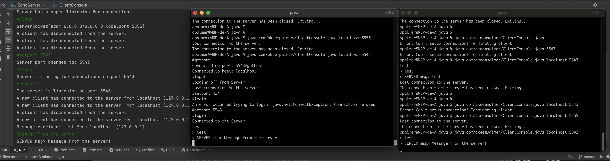

# Java OCSF Framework Modification

## COMP 3415 - Software Engineering Individual Project

### Tasks - Phase 1 (Client Modifications):

1. In Simple Chat, if the server shuts down while a client is connected, the
   client does not respond, and continues to wait for messages. Modify the
   client so that it responds to the shutdown of server by printing a message
   saying the server has shut down, and quitting. (look at the methods called
   connectionClosed and connectionException).
2. The client currently always uses a default port. Modify the client so that
   it obtains the port number from the command line. (look at the way it
   obtains the host name from the command line).
3. . Currently, the client simply sends to the server everything the end-user
   types. When the server receives these messages it simply echoes them
   to all clients. Add a mechanism so that the user of the client can type
   commands that perform special functions. Each command should start
   with the ’#’ symbol - in fact, anything that starts with that symbol should be considered a command. You should implement the following commands:
   - (a) #quit cause the client to terminate gracefully. Make sure the connection to the server is terminated before exiting the program.
   - (b) #logoff causes the client to disconnect from the server, but not quit.
   - (c) #sethost <host> calls the setHost method in the client. Only allowed if the client is logged off; displays an error message otherwise.
   - (d) #setport <prot> calls the setPort method in the client, with the
   same constraints as #sethost.
   - (e) #login causes the client to connect to the server. Only allowed if the client is not already connected; display an error message otherwise.
   - (f) #gethost displays the current host name.
   - (g) #getport displays the current port number.

### Tasks - Phase 1 (Server Modifications) :

1. Currently, the server ignores situations where clients connect or disconnect.
   Modify the server so that it prints out a nice message whenever a client
   connects or disconnects. (write code in EchoServer that overrides certain
   methods found in AbstractServer).
   2
2. Currently, the server does not allow any user input. Study the way user
   input in obtained from the client, using the ClientConsole class, which
   implements the ChatIF interface. Create an analogous mechanism on the
   server side. (add a new class ServerConsole that also implements the
   ChatIF interface. Anything typed on the server’s console should be echoed
   to the server’s console and to all the clients. The message is prefixed by
   the string SERVER msg>).
3. • In a similar manner to the way you implemented commands on the client side,
   add a mechanism so that the user of the server can type commands that perform
   special functions.
   - #quit cause the server to terminate gracefully.
   - #stop causes the server to stop listening for new clients.
   - #close causes the server not only to stop listening for new clients, but also to disconnect all existing clients.
   - #setport <port> calls the setPort method in the server. Only allowed
     if the server is closed.
   - #start causes the server starts to listening for new clients. Only valid if the server is stopped.
   - #getport displays the current port number.

## Phase 1 Results

